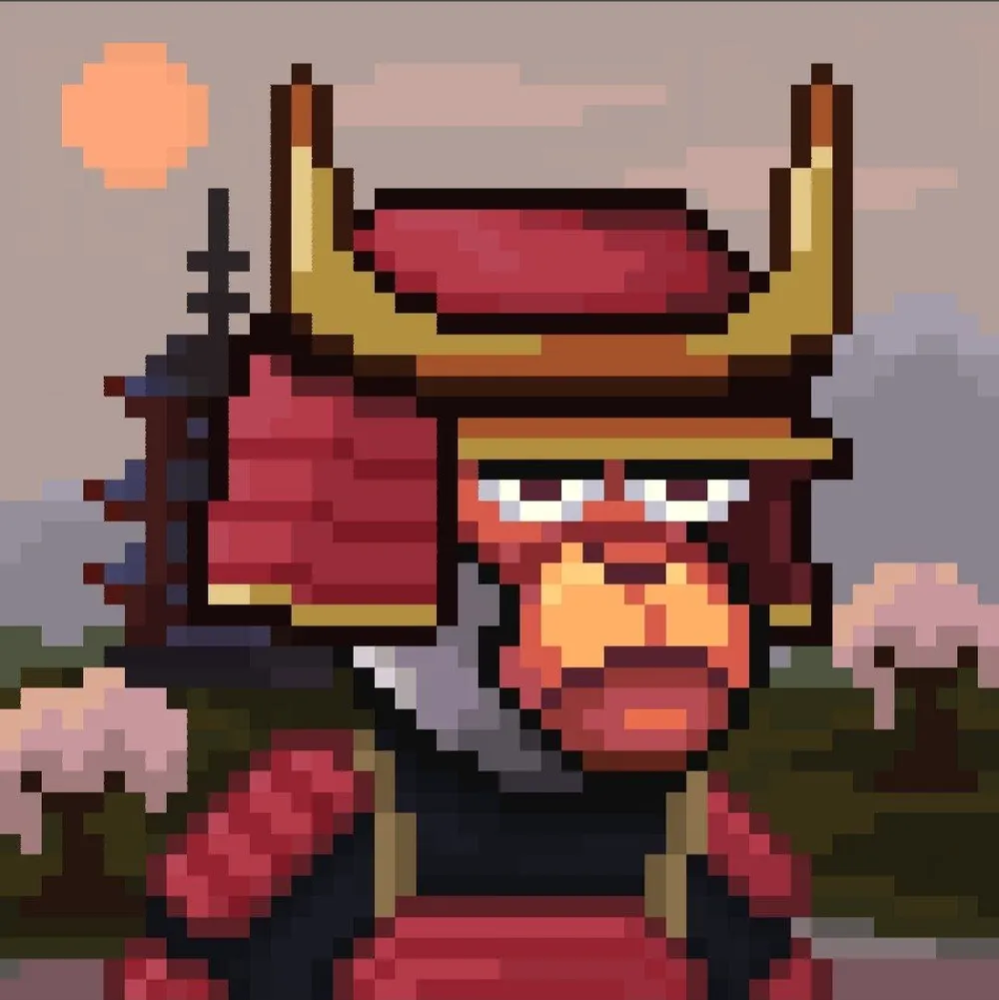

# CHESTER — Portfolio для GitHub Pages

Одностраничный адаптивный сайт-портфолио в светлой техно-эстетике, собранный на **чистых HTML / CSS / JavaScript** без сборщиков.

## Что внутри

- hero-блок с крупной типографикой;
- секции `02 - COLLECTION`, `03 - BOTS`, `04 - BRANDS`, `05 - CONTACT`;
- бесконечная лента NFT-карточек;
- анимация появления блоков при скролле;
- структура, удобная для редактирования прямо в GitHub.

## Структура проекта

```text
index.html
style.css
script.js
README.md
images/
  cat-hero.png
  nft1.jpg
  nft2.jpg
  nft3.jpg
  nft4.jpg
  nft5.jpg
```

## Локальный запуск

1. Скачайте или клонируйте репозиторий.
2. Откройте `index.html` двойным кликом в браузере.
3. Либо запустите локальный сервер, например через VS Code Live Server.

## Как редактировать сайт вручную

### Текст
Откройте `index.html` и меняйте нужные строки прямо в секциях:
- заголовок в hero;
- подписи карточек;
- контакты;
- описания блоков.

### Картинки
Все изображения лежат в папке `images/`.

Чтобы заменить картинку:
1. загрузите новый файл в `images/`;
2. сохраните имя файла;
3. замените путь в `index.html`, например:
   `images/cat-hero.png` → `images/my-cat.png`

### Добавить новую карточку в NFT-ленту
Скопируйте один из блоков:
```html
<div class="card nft-card">
  
  <span>Cat Card</span>
</div>
```

И вставьте его в `.marquee__track`.  
Чтобы движение осталось бесшовным, продублируйте карточки во второй половине ленты.

## Настройка GitHub Pages

1. Загрузите файлы в репозиторий GitHub.
2. Перейдите в **Settings → Pages**.
3. В разделе **Build and deployment** выберите:
   - Source: `Deploy from a branch`
   - Branch: `main` / `master`
   - Folder: `/ (root)`
4. Сохраните настройки.
5. Через несколько минут GitHub Pages выдаст публичную ссылку.

## Где что менять

- `index.html` — разметка и тексты.
- `style.css` — цвета, сетка, адаптив и визуал.
- `script.js` — анимации.
- `images/` — изображения сайта.

## Примечание

Если захотите сделать сайт ближе к референсу, достаточно заменить:
- картинку героя,
- набор NFT-карточек,
- текстовые блоки,
- контактные данные.

После этого сайт останется простым в сопровождении и готовым к бесплатному деплою на GitHub Pages.
